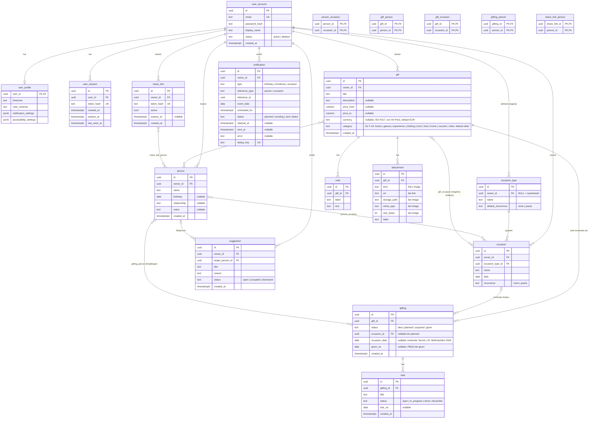

# Datenmodell

Verbindliche Vorlage für `backend/src/giftmanager/models/`. Ersetzt inhaltlich das unvollständige `ER-Modell/ER-Modell.graphml` und ist mit der Tabelle „Vorgesehenes Zielmodell“ aus MS 1 abgeglichen. Tabellen- und Spaltennamen sind Englisch (Code-Sprache), die Beschreibung Deutsch.

Konventionen: Primärschlüssel `id` als UUID (v7, clientseitig), Tabellen heißen `user_account` und `user_session`, weil `user` in PostgreSQL reserviert ist, technische Zeitpunkte `timestamptz` in UTC, Kalenderdaten `date` (Q-08). Jede kontogebundene Tabelle hat `owner_id → user_account.id ON DELETE CASCADE` mit Index (Q-01, F-17). Abhängige Tabellen kaskadieren über ihre Elterntabelle.

## Geschäftsregeln, die das Schema absichert

| Regel | Umsetzung |
|---|---|
| Eine Idee kann ohne Empfänger und Anlass existieren (F-04, F-05) | `gift_person`, `gift_occasion` optional; `gifting.occasion_id` nullable |
| Schnellerfassung einer Idee nur mit Titel (F-05) | übrige `gift`-Spalten nullable oder mit Default: `category` `other` |
| Eine Währung gibt es nur zu einem Preis (F-05) | Check-Constraint `ck_gift_currency_with_price` auf `(currency IS NULL) = (price_from IS NULL AND price_to IS NULL)`; die API setzt `EUR`, wenn ein Preis ohne Währung kommt, und verwirft die Währung ohne Preis |
| Gemeinsames Geschenk an mehrere Personen (F-04, F-06) | eine `gifting`-Zeile, mehrere `gifting_person`-Zeilen |
| Unabhängige Beschenkungen derselben Idee | mehrere `gifting`-Zeilen je `gift` |
| Bei `given` sind Empfänger, Anlass, Termin, Verschenkdatum Pflicht (F-06) | Check-Constraint `ck_gifting_given_complete` auf `status <> 'given' OR (occasion_id IS NOT NULL AND occasion_date IS NOT NULL AND given_on IS NOT NULL)`; mindestens ein Empfänger wird im Service geprüft |
| Weihnachten 2026 ≠ Weihnachten 2027 | `gifting.occasion_date` trägt den konkreten Termin, `occasion` nur die Regel |
| Kein Doppelversand (F-13, Q-02) | `UNIQUE(dedup_key)` auf `notification` |
| Freigabelink nicht erratbar, widerrufbar, ablaufend (F-14) | 256-Bit-Token, nur `token_hash` gespeichert, `active`, `expires_at` |
| Kontolöschung löscht alles (F-17) | `ON DELETE CASCADE` auf allen `owner_id` und auf `user_session.user_id`; Dateien aus `attachment.storage_path` werden nach dem Commit gelöscht |
| Geburtstag nur zusammen mit der Person (F-03, F-04) | Quelle ist `person.birthday`; der Service pflegt daraus genau einen `occasion` vom Typ „Geburtstag“ (jährlich, Datum = Geburtsdatum), verknüpft über `person_occasion` mit genau dieser Person. Über die API ist der Typ nicht wählbar (422) und ein solcher Anlass nicht änderbar oder löschbar (409) |
| Systemweite Anlasstypen (F-03) | `occasion_type.owner_id IS NULL`; „Geburtstag“ und „Weihnachten“ per Daten-Migration |
| Vorschläge nur aus aggregierten Merkmalen (F-16, Q-04) | Aggregation über `gift.category`, Preisband aus `price_from/price_to`, `occasion_type.name`; nie über `title`, `description`, `note`, `attachment` |

## Indizes

Neben den Primär- und Unique-Schlüsseln: Index auf jedem `owner_id`, jedem Fremdschlüssel, `notification(status, scheduled_for)` für den Scheduler, `person(owner_id, birthday)` für die Geburtstagsplanung und `gift(owner_id, created_at)` für die Ideenliste.

## Offene Punkte

- Preisband für F-16: Grenzen festlegen (Vorschlag: `<20`, `20–50`, `50–100`, `>100`).
- Altersgruppe für F-16 wird zur Laufzeit aus `person.birthday` abgeleitet, nicht gespeichert.
