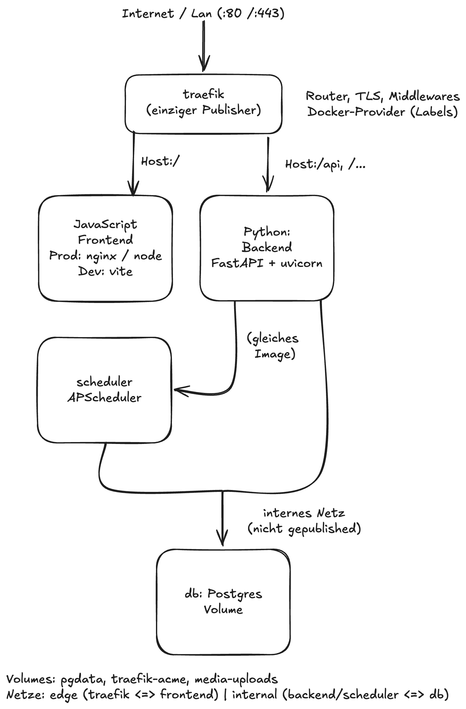

# Projektvision

Der **Geschenke-Manager** wird als datenschutzorientierte, browserbasierte Webanwendung konzipiert und prototypisch umgesetzt. Die Anwendung bündelt Informationen zu Personen, Anlässe, Geschenkideen, vergangene Geschenke und offene Aufgaben. Sie unterstützt eine rechtzeitige Planung und hilft, unbeabsichtigte Wiederholungen und kurzfristigen Beschaffungsstress zu vermeiden.

Personen, Anlässe und Geschenkideen können unabhängig voneinander erfasst und flexibel verknüpft werden. Eine Idee lässt sich dadurch sofort festhalten, auch wenn Empfänger:innen oder Anlass noch nicht feststehen. Sie kann für ein gemeinsames Geschenk an mehrere Personen oder für mehrere unabhängige Beschenkungen verwendet werden. Der jeweilige Planungs- und Beschaffungsstand bleibt dabei eindeutig zugeordnet.

Automatische Benachrichtigungen erinnern an bevorstehende Anlässe und unterstützen die Beschaffung. Widerrufbare Freigabelinks ermöglichen das kontrollierte Teilen von Ideen zu ausgewählten Personen. Weitere Vorschläge werden aus anonymisierten und aggregierten Merkmalen vergangener Geschenke und vorhandener Geschenkideen abgeleitet. Personenbezogene Inhalte anderer Konten werden dabei nicht offengelegt.

# Vorstellung des Teams

| Teammitglied | Foto | Kurzprofil | Skills |
| --- | --- | --- | --- |
| **Yin Yin Wu-Hanke** |  | Detection Engineer | Frontendentwicklung, Security |
| **Julian Ammann** |  | Senior Full Stack Developer | Frontend- & Backendentwicklung, DevOps, Systemarchitektur |
| **Anton Hirsch** |  | Studium der Informatik (Bachelor) | Grundlagen in Python, Java, C++, SQL sowie KI-gestützter Recherche und Problemlösung |
| **Kevin Jordan Taghu** |  | Data Analyst | Frontendentwicklung, Datenmodellierung, Reporting, Datenvisualisierung, Datenbereinigung |

# Anforderungen (auf grober Ebene)

Die Anforderungen beschreiben den vorgesehenen Umfang des Prototyps. **MUSS** kennzeichnet den verbindlich geplanten Kernumfang einschließlich der vom Team gewählten Ergänzungen. **SOLL** kennzeichnet Erweiterungen, die umgesetzt werden, sofern der Kernumfang und seine Qualität dadurch nicht gefährdet werden. Die Anforderungen des Themenblatts bilden die verbindliche Grundlage.

MS 3 konkretisiert das Anforderungsmanagement, die technische Konfiguration und die Qualitätsplanung. Detaillierte Akzeptanzkriterien und Testfälle werden im Verlauf der weiteren Ausarbeitung und Umsetzung erstellt.

## Funktionale Anforderungen

| ID | Priorität | Anforderung |
| --- | --- | --- |
| F-01 | MUSS | Nutzer:innen können sich registrieren, anmelden und abmelden. Kontogebundene fachliche Daten gehören genau einem Konto. Feste Anlasstypen stehen systemweit zur Verfügung. |
| F-02 | MUSS | Personen können mit Name, Geburtstag, Beziehung und Notizen angelegt, angezeigt, geändert und gelöscht werden. Der Erstellzeitpunkt wird automatisch gespeichert. |
| F-03 | MUSS | Geburtstag und Weihnachten stehen als feste Anlasstypen zur Verfügung. Eigene einmalige und wiederkehrende Anlässe können angelegt werden. |
| F-04 | MUSS | Personen, Anlässe und Geschenkideen können unabhängig angelegt und flexibel in n:m-Beziehungen verknüpft oder wieder getrennt werden. Eine Idee kann sowohl für gemeinsame Geschenke als auch für unabhängige Beschenkungen verwendet werden. |
| F-05 | MUSS | Eine Geschenkidee lässt sich schnell mit einem Titel erfassen und um Beschreibung und Preisrahmen ergänzen. Der Erstellzeitpunkt wird automatisch gespeichert. |
| F-06 | MUSS | Jede konkrete Verwendung einer Idee wird als **Beschenkung** mit einem eigenen Status geführt. Mögliche Statuswerte sind **Idee**, **Geplant**, **Besorgt** und **Verschenkt**. Beim Verschenken werden die tatsächlichen Empfänger:innen, der Anlass und das Verschenkdatum festgehalten. Vergangene Geschenke können auch direkt nachgetragen werden. |
| F-07 | MUSS | Geschenkideen können durch beschriftete Notizen, Links und Bilder ergänzt werden. |
| F-08 | MUSS | Aufgaben werden für die jeweilige Beschenkung verwaltet. Mögliche Statuswerte sind **Offen**, **In Bearbeitung**, **Erledigt** und **Verworfen**. Aufgaben können bereits während der Ideenphase angelegt werden. |
| F-09 | MUSS | Die Personenansicht zeigt gleichzeitig vergangene Geschenke und vorhandene Geschenkideen sowie die zugehörigen Anlässe, Beschaffungsstände und Aufgaben. |
| F-10 | MUSS | Das System versendet automatische Benachrichtigungen über Geburtstage im folgenden Monat. Diese enthalten bereits bekannte Geschenkideen für die betroffenen Personen. |
| F-11 | MUSS | Sechs Wochen vor Weihnachten beginnt der regelmäßige Versand einer Statusübersicht über die vorgesehenen Empfänger:innen und den jeweiligen Beschaffungsstand. |
| F-12 | MUSS | Etwa zwei Wochen vor einem konkreten Anlasstermin prüft das System die Beschenkungen der vorgesehenen Empfänger:innen. Es erinnert die Nutzer:innen an Personen ohne zugeordnete Beschenkung und an Beschenkungen mit dem Status **Idee** oder **Geplant**. Bereits besorgte oder verschenkte Geschenke für dieselbe Person und denselben Termin verhindern diese Erinnerung nicht. |
| F-13 | MUSS | Planung, Versandversuch und Ergebnis einer Benachrichtigung werden gespeichert. Wiederholte oder parallele Scheduler-Läufe dürfen keinen zusätzlichen Versandauftrag für dieselbe geplante Nachricht erzeugen. |
| F-14 | MUSS | Ideen ausgewählter Personen können über einen nicht erratbaren, optional ablaufenden und jederzeit deaktivierbaren Nur-Lese-Link geteilt werden. |
| F-15 | MUSS | Die vollständige eigene Liste mit Personen, Geschenkideen und vergangenen Geschenken kann als HTML dargestellt werden. |
| F-16 | MUSS | Das System erzeugt aus anonymisierten und aggregierten Merkmalen vergangener Geschenke und vorhandener Geschenkideen weitere Vorschläge. Bereits vorhandene oder verschenkte Ideen der Zielperson werden ausgeschlossen. Vorschläge können einfach übernommen oder verworfen werden. |
| F-17 | MUSS | Nutzer:innen können das eigene Konto einschließlich aller zugehörigen kontogebundenen Daten löschen. |
| F-18 | SOLL | Ein Nutzerprofil ermöglicht persönliche Zeitzonen-, Benachrichtigungs- und Barrierefreiheitseinstellungen, beispielsweise geeignete Farbschemata. |
| F-19 | SOLL | Der Turnus bestimmter Erinnerungen kann innerhalb vorgegebener Grenzen angepasst werden. |

## Qualitätsanforderungen

| ID | Qualitätsziel | Konkretisierung für das Projekt |
| --- | --- | --- |
| Q-01 | Mandantentrennung | Kontogebundene Daten werden vor unberechtigtem Lesen und Verändern geschützt. Gültige Freigabelinks erlauben ausschließlich den ausdrücklich freigegebenen, lesenden Zugriff. |
| Q-02 | Benachrichtigungszuverlässigkeit | Der Versand berücksichtigt den konkreten Ereignistermin und das Erinnerungsintervall. Wiederholte oder parallele Verarbeitung führt nicht zu zusätzlichen Versandaufträgen. Unklare Versandergebnisse werden vor einem erneuten Versuch geklärt. |
| Q-03 | Sicherheit | Passwörter werden mit einem etablierten Passwort-Hashverfahren gespeichert. Die Anwendung nutzt HTTPS, sichere Sitzungen, serverseitige Autorisierung und nicht erratbare Freigabetokens. |
| Q-04 | Datenschutz | Entwicklung, Tests und Demonstrationen verwenden synthetische fachliche Beispieldaten. Namen, E-Mail-Adressen, Freitextnotizen, URLs und Anhänge werden nicht kontenübergreifend für Vorschläge genutzt. |
| Q-05 | Leistung | Listen sollen bei einem Testbestand von 100 Personen, 1.000 Geschenkideen und 1.000 Beschenkungen im Regelfall innerhalb von zwei Sekunden angezeigt werden. Die Testumgebung wird in MS 3 konkretisiert. |
| Q-06 | Wartbarkeit | Das relationale Datenmodell wird mindestens bis zur dritten Normalform strukturiert. Quellcode wird gelintet, getestet und vor der Zusammenführung geprüft. |
| Q-07 | Barrierefreiheit | Wesentliche Abläufe sind per Tastatur bedienbar. Zustände werden nicht ausschließlich über Farben vermittelt. |
| Q-08 | Zeitkorrektheit | Technische Zeitpunkte werden in UTC gespeichert. Geburtsdaten, Anlasstermine und Verschenkdaten werden als reine Kalenderdaten ohne Uhrzeit gespeichert. |
| Q-09 | Nachvollziehbarkeit | Anforderungen und wesentliche Entscheidungen werden nachvollziehbar dokumentiert. Prüfungen der Liefergegenstände und ihre Ergebnisse werden in den vorgesehenen Projektunterlagen festgehalten. |

## Randbedingungen

### Technische Randbedingungen

- Die Anwendung besteht aus einer browserbasierten Benutzeroberfläche, einem Backend mit API und einer relationalen Datenbank.
- Spätestens zu MS 4 ist das System für den Tutor über einen Browser erreichbar und mit Testkonten ohne lokale Installation prüfbar.
- JavaScript für das Frontend, Python für das Backend und der containerisierte Betrieb sind vorgesehen. Die technische Konfiguration wird in MS 3 anhand kurzer Probeläufe konkretisiert. Dabei werden insbesondere das Datenbankprodukt, das Hosting und der E-Mail-Dienst festgelegt.
- Bilddateien werden geschützt gespeichert. Die Datenbank enthält ihre Metadaten und Speicherreferenzen.
- Geheimnisse, Passwörter und personenbezogene fachliche Testdaten werden nicht im Repository gespeichert.

### Organisatorische Randbedingungen

- Der Projektzeitraum reicht vom 20.08.2026 bis spätestens 31.10.2026. MS 1 wird spätestens am 10.09.2026 abgegeben.
- Redmine dient der formalen Bereitstellung, dem Tutorfeedback und der Abnahme. Bei einer Abgabe wird das jeweilige Ticket auf **Feedback** gesetzt und dem Tutor zugewiesen. Die Abnahme erfolgt durch den Tutor mit dem Ticketstatus **closed**.
- Microsoft Teams wird für Regelmeetings und ausführliche Abstimmungen genutzt. Signal dient kurzfristigen Abstimmungen und wichtigen Projektmeldungen.
- Quellcode und technische Dokumentation werden im **[öffentlichen GitHub-Repository](https://github.com/julianammann/isefgm)** versioniert. Der Tutor kann die bereitgestellten Inhalte ohne gesonderte Repository-Freigabe einsehen. Schreibzugriffe sind auf berechtigte Mitwirkende beschränkt.
- Für `main` ist das Regelwerk **Main-Branch-Protection** aktiv. Es verlangt Pull Requests mit mindestens einer Review-Freigabe und enthält Schutzregeln gegen Branch-Löschung und Force-Pushes. Das Team bearbeitet Änderungen in eigenen Branches und lässt den zur Zusammenführung vorgesehenen Stand durch ein anderes Teammitglied prüfen.
- Wesentliche Architektur-, Datenschutz-, Umfangs- und Terminentscheidungen werden kurz in den vorhandenen Projektunterlagen festgehalten.

### Konventionen

- Architektur und Datenmodell werden in der vorgesehenen technischen Dokumentation durch versionierte Diagramme und Beschreibungen erläutert.
- Quellcode wird automatisch formatiert und gelintet. Unit-, Integrations-, Berechtigungs- und E2E-Tests sichern den Prototyp ab. Ihr Umfang wird in MS 3 festgelegt.
- Commit-Nachrichten folgen einem einheitlichen, kurzen Schema. Conventional Commits können dafür verwendet werden.

# Lösungsansatz

## Fachlicher Ansatz

Das gemeinsame Objekt **Geschenk/Idee** enthält die wiederverwendbaren Inhalte einer Idee, etwa Titel, Beschreibung, Preisrahmen, Notizen, Links und Bilder. Eine **Beschenkung** beschreibt eine einzelne geplante oder bereits erfolgte Verwendung dieser Idee. Zu jeder Beschenkung werden der Status, der Anlass, die Empfänger:innen und das Verschenkdatum festgehalten. Beim Übergang zu einem vergangenen Geschenk müssen die Inhalte der Idee daher nicht erneut erfasst oder kopiert werden.

Die Zuordnungen zwischen Personen, Anlässen und Geschenkideen bleiben flexibel. Sie beschreiben mögliche Verwendungen und erzeugen nicht automatisch sämtliche Kombinationen als Beschenkungen. Für die konkrete Verwendung gelten folgende Regeln:

- Eine Idee kann ohne festgelegte Empfänger:innen oder Anlässe gespeichert werden. Bei Bedarf lässt sich bereits eine Beschenkung im Status **Idee** mit offenen Aufgaben anlegen.
- Mehrere Personen innerhalb **einer Beschenkung** erhalten ein gemeinsames Geschenk. Status, Beschaffungsaufgaben und Verschenkdatum gelten für diese Beschenkung gemeinsam.
- Wird dieselbe Idee unabhängig für weitere Personen oder Termine verwendet, wird jeweils eine **eigene Beschenkung** angelegt. Status und Aufgaben werden für jede Beschenkung getrennt geführt.
- Einer Idee können mehrere mögliche Anlässe zugeordnet sein. Eine konkrete Beschenkung bezieht sich auf höchstens einen Anlass und dessen konkreten Termin. Beide Angaben können während der Ideenphase noch offenbleiben.
- Spätestens beim Status **Verschenkt** sind mindestens eine Empfängerperson, der tatsächliche Anlass, dessen konkreter Termin und das Verschenkdatum festgelegt. Der Anlasstermin unterscheidet beispielsweise Weihnachten 2026 von Weihnachten 2027. Das Verschenkdatum kann vom Anlasstermin abweichen.

Der Bearbeitungsstand wird ausschließlich je Beschenkung geführt. Eine noch nicht konkret verwendete Idee erscheint weiterhin in der Ideenliste. In der Personenansicht werden nur die für die jeweilige Person relevanten Beschenkungen und Aufgaben angezeigt.

## Vorgesehenes Zielmodell

| Entität / Beziehung | Wesentliche Inhalte |
| --- | --- |
| Nutzer | ID, E-Mail, Passwort-Hash, Anzeigename, Kontostatus, erstellt am |
| Nutzerprofil | Bei Umsetzung von F-18: Nutzer-ID, Zeitzone, Farbschema, Barrierefreiheits- und Benachrichtigungseinstellungen |
| Person | ID, Besitzer-Nutzer-ID, Name, Geburtstag, Beziehung, Notizen, erstellt am |
| Anlasstyp | ID, Besitzer-Nutzer-ID oder systemweit, Name, Standardwiederholung |
| Anlass | ID, Besitzer-Nutzer-ID, Anlasstyp-ID, Name, Kalenderdatum, Wiederholungsregel |
| Geschenk/Idee | ID, Besitzer-Nutzer-ID, Titel, Beschreibung, Preis von/bis, Währung, erstellt am |
| Person–Anlass | Flexible Zuordnung von Personen und vorgesehenen Anlässen |
| Geschenk–Person | Flexible Zuordnung von Ideen und möglichen Empfänger:innen |
| Geschenk–Anlass | Flexible Zuordnung von Ideen und möglichen Anlässen |
| Beschenkung | ID, Geschenk-ID, Status, Anlass-ID, konkreter Anlasstermin, verschenkt am. Anlass und Termine sind abhängig vom Bearbeitungsstand. |
| Beschenkung–Person | Zuordnung einer Beschenkung zu einer oder mehreren gemeinsamen Empfänger:innen |
| Notiz | ID, Geschenk-ID, Beschriftung, Text |
| Anhang | ID, Geschenk-ID, Art: Link oder Bild, URL beziehungsweise Speicherreferenz, Beschriftung |
| Aufgabe | ID, Beschenkung-ID, Titel, Status, optional Fälligkeit |
| Teilen-Link | ID, Besitzer-Nutzer-ID, Token-Hash, aktiv, läuft ab, erstellt am |
| Teilen-Link–Person | Zuordnung der für einen Link ausgewählten Personen |
| Ideen-Vorschlag | ID, Besitzer-Nutzer-ID, Zielperson-ID, Titel, Begründung, Status, erstellt am |
| Benachrichtigung | ID, Besitzer-Nutzer-ID, Typ, Bezug, konkreter Ereignistermin, geplant für, Status, gesendet am, Fehler, Deduplizierungsschlüssel |

Bei der Verknüpfung kontogebundener Datensätze wird serverseitig geprüft, dass sie demselben Nutzerkonto gehören. Systemweit bereitgestellte Anlasstypen dürfen von allen Konten verwendet werden. Freigabelinks öffnen ausschließlich die vorgesehenen Ideeninhalte zu den ausgewählten Personen. Sie geben keinen Zugriff auf andere Kontoinhalte oder unabhängige Beschenkungen. Die Auswahl einer Person erteilt keine allgemeine Freigabe ihrer Stammdaten.

## Benachrichtigungs- und Vorschlagsansatz

Ein regelmäßig ausgeführter Scheduler ermittelt anstehende Ereignisse und bereitet die Benachrichtigungen vor. Kalenderdaten werden anhand einer festgelegten Standardzeitzone ausgewertet. Bei Umsetzung des Nutzerprofils kann eine persönliche Zeitzone diese Vorgabe ersetzen. Technische Versandzeitpunkte werden in UTC gespeichert.

Jede geplante Benachrichtigung erhält einen eindeutigen Schlüssel aus Konto, Ereignisbezug, konkretem Ereignistermin, Nachrichtentyp und Erinnerungsintervall. Schlüssel, Bearbeitungsstatus und eine gegen parallele Ausführung abgesicherte Verarbeitung verhindern mehrfach erzeugte Versandaufträge.

Bei unklarem Versandergebnis erfolgt vor einem erneuten Versand eine Prüfung. Die technische Behandlung von Versandfehlern wird in MS 3 konkretisiert.

Zeitabhängige Funktionen werden mit geeigneten Testzeitpunkten geprüft. Dadurch lassen sich auch Weihnachtsbenachrichtigungen innerhalb des Projektzeitraums überprüfen.

Vorschläge berücksichtigen vergangene Geschenke und vorhandene Geschenkideen. Die kontenübergreifende Auswertung verwendet ausschließlich anonymisierte und aggregierte Merkmale, beispielsweise Geschenkekategorie, Preisband, grobe Altersgruppe und Anlassart. Geeignete Merkmale und ihre Ableitung werden in MS 3 konkretisiert. Namen, Kontaktdaten, individuelle Freitexte, Links und Bilder werden nicht übernommen. Für Tests und Demonstrationen werden synthetische Beispieldaten verwendet.

Vor der Anzeige werden Ideen ausgeschlossen, die für die Zielperson bereits vorhanden oder als verschenkt dokumentiert sind. Dieser Filter betrifft automatische Vorschläge. Eine vorhandene Idee kann weiterhin manuell für eine erneute Beschenkung verwendet werden. Ausgewählte Vorschläge werden einfach in die eigene Ideenliste übernommen.

# Annahmen und Beschränkungen

## Annahmen

- Das Projektthema **Geschenke-Manager** und die Zusammensetzung des vierköpfigen Teams sind durch den Tutor bestätigt.
- Die Teammitglieder arbeiten bis Ende Oktober regelmäßig am Projekt und stimmen Verfügbarkeit, Aufgabenverteilung und erkennbare Engpässe gemeinsam ab.
- Entwicklung, Tests und Demonstrationen der Anwendung verwenden ausschließlich synthetische fachliche Beispieldaten. Angaben und Fotos zur Teamvorstellung sind davon nicht betroffen.
- Ein kontrollierter E-Mail-Testkanal und eine vom Tutor erreichbare Demo-Umgebung können bereitgestellt werden.
- Der geforderte Funktionsumfang wird als einfacher, durchgängiger Prototyp umgesetzt.

## Beschränkungen und Nicht-Ziele

- Native Smartphone-Apps und Offline-Synchronisation sind nicht vorgesehen.
- Kalender-, Kontakt-, Händler-, Preisvergleichs- und Zahlungsintegrationen gehören nicht zum Projektumfang.
- Freigabelinks ermöglichen ausschließlich lesenden Zugriff. Gemeinsames Bearbeiten ist nicht vorgesehen.
- Ergänzende Inhalte beschränken sich auf Texte, Links und Bilder. Für hochgeladene Bilder werden zulässige Dateitypen und Größen festgelegt. Weitere Dateianhänge sind aktuell nicht vorgesehen.
- Die vollständige Liste wird als HTML im Browser dargestellt. Ein zusätzlicher Download als HTML-Datei ist aktuell nicht eingeplant.
- Das Vorschlagsverfahren bleibt nachvollziehbar und verwendet keine personenbezogenen Freitexte anderer Konten.
- MS 3 konkretisiert den bestehenden Entwurf und die Qualitätsplanung. Sicherheits- und Datenschutzmaßnahmen werden in die vorgesehenen Entwicklungs- und Dokumentationsunterlagen integriert.

# Meilensteinplan (aktualisierte Version auf Basis von MS 0)

Die Terminplanung für MS 1 bis MS 6 basiert auf dem Gantt-Plan aus MS 0. In dieser Darstellung steht die Meilensteinbezeichnung vor dem zugehörigen Bearbeitungsbalken. Die Abgabe ist jeweils am Ende dieses Bearbeitungszeitraums vorgesehen.

| Meilenstein | Bearbeitungszeitraum | Geplante Abgabe |
| --- | --- | --- |
| MS 1: Projektkonfiguration | Ende KW 35 bis KW 37 | 10.09.2026 |
| MS 2: Projektvideo | KW 37 | 13.09.2026 |
| MS 3: Konfiguration der Softwareentwicklung und Qualitätsplanung | Ende KW 37 bis KW 39 | 27.09.2026 |
| MS 4: Softwaresystem und Dokumentation | KW 40–41 | 11.10.2026 |
| MS 5: Ergebnispräsentation | KW 42 | 18.10.2026 |
| MS 6: Projektbericht | KW 43–44 | 31.10.2026 |

Der interne Abschluss der Entwicklungsarbeiten ist für den **08.10.2026** vorgesehen. Technische Probeläufe und Vorbereitungen erfolgen bereits im Rahmen von MS 3. Qualitätssicherung und Dokumentation begleiten die Erstellung der Ergebnisse.

Die letzten zwei Tage vor jeder Abgabe sind grundsätzlich für Review, Korrektur und Bereitstellung reserviert. Diese Arbeiten und die Aufwandsreserve liegen innerhalb des geplanten Projektzeitraums. Der 30. und 31. Oktober gehören zur Abschlussbearbeitung von MS 6.

Absehbare Abweichungen werden unmittelbar über Signal mitgeteilt und im nächsten Teams-Termin bewertet. Änderungen bereits mit dem Tutor vereinbarter Abgabetermine werden mit ihm abgestimmt.

# Liste der Liefergegenstände mit Zuordnung zu den Meilensteinen

| Meilenstein | Liefergegenstand | Bereitstellung und Vorgabe |
| --- | --- | --- |
| MS 0 | Meilensteinplan | PDF oder Bild in Redmine |
| MS 1 | Projektkonfiguration | PDF in Redmine |
| MS 2 | Projektvideo | Video oder Link in Redmine. Maximale Länge: fünf Minuten. |
| MS 3 | Konfiguration der Softwareentwicklung und Qualitätsplanung | PDF in Redmine |
| MS 4 | Benutzerhandbuch | Über das Redmine-Ticket erreichbar |
| MS 4 | Fachliche Dokumentation: Prozesse, Konzepte und Geschäftsregeln | Über das Redmine-Ticket erreichbar |
| MS 4 | Technische Dokumentation: Architektur, Komponenten, Schnittstellen und Datenbank | Über das Redmine-Ticket erreichbar |
| MS 4 | Betriebsdokumentation: Installation, Konfiguration und Admin-Account | Über das Redmine-Ticket erreichbar |
| MS 4 | Testabschlussbericht einschließlich Testfällen und Testprotokollen | Über das Redmine-Ticket erreichbar |
| MS 4 | Programmcode beziehungsweise Link zum Repository | Über das Redmine-Ticket erreichbar |
| MS 4 | Link zum erstellten System | Über das Redmine-Ticket erreichbar und im Browser ohne lokale Installation prüfbar |
| MS 4 | Liste mit Testkonten und Zugangsdaten | Bereitstellung in Redmine. Keine Zugangsdaten im öffentlichen Repository. |
| MS 5 | Ergebnispräsentation | Video oder Link in Redmine. Maximale Gesamtlänge: 20 Minuten. Die Demo umfasst höchstens sieben Minuten. |
| MS 6 | Gemeinsamer Projektbericht | Gesonderte Abgabe durch jedes Mitglied in Turnitin. Die Ticketkommunikation erfolgt über Redmine. |

Das Team benennt für jeden Liefergegenstand eine verantwortliche und eine prüfende Person. Prüfergebnisse und erforderliche Korrekturen werden in den vorhandenen Projektunterlagen oder am zugehörigen Ticket festgehalten. Versionen und Speicherorte ergeben sich aus dem Repository und den Abgabefassungen. Tutorfeedback und Abnahmestatus werden über Redmine nachvollzogen.

# Projektstrukturplan

Der Projektstrukturplan umfasst die aktuell bekannten Arbeitspakete. Planung, Steuerung und Qualitätssicherung begleiten den gesamten Projektverlauf. Die technische Umsetzung unter 4.0–4.7 führt zum Softwaresystem für MS 4. Arbeitspaket 6.0 bündelt die zugehörige Dokumentation und formale Bereitstellung. Die weitere technische Untergliederung erfolgt in MS 3.

| PSP-ID | Arbeitspaket | Bekannte Teilaufgaben und Ergebnisse |
| --- | --- | --- |
| 1.0 | Projektplanung und -steuerung | Termine, Abstimmungen, Fortschritt, Änderungen und Risiken koordinieren |
| 1.1 | MS 0 – Meilensteinplan | Projektzeitraum und Meilensteine festlegen, Plan visualisieren und bereitstellen |
| 1.2 | MS 1 – Projektkonfiguration | Vision, Team, Anforderungen, Lösungsansatz, Projektstruktur, Aufwand, Rollen, Infrastruktur und Risiken dokumentieren |
| 2.0 | MS 2 – Projektvideo | Inhalte und Ablauf planen, Sprecher:innen festlegen, aufnehmen, prüfen und bereitstellen |
| 3.0 | MS 3 – Entwicklungs- und Qualitätskonfiguration | Vorgehensmodell, Entwicklungsumgebung, Artefakte, technische Rollen, Qualitätsziele, Prüfverfahren und Liefergegenstände festlegen |
| 4.0 | Softwaresystem | Anwendung implementieren, integrieren und technisch bereitstellen |
| 4.1 | Entwicklungsumgebung und Infrastruktur | Repository-Struktur, Entwicklungsumgebung, Container, Datenbank, CI/CD und Hosting vorbereiten |
| 4.2 | Nutzer- und Zugriffsverwaltung | Registrierung, Anmeldung, Sitzungen, Mandantentrennung und Kontolöschung umsetzen. Nutzerprofil als SOLL-Erweiterung berücksichtigen |
| 4.3 | Personen und Anlässe | Personenverwaltung, feste und benutzerdefinierte Anlässe sowie Zuordnungen umsetzen |
| 4.4 | Geschenke und Aufgaben | Ideen, gemeinsame und unabhängige Beschenkungen, Status, Historie, Notizen, Links, Bilder und Aufgaben umsetzen |
| 4.5 | Benachrichtigungen | Geburtstags-, Weihnachts- und zusätzliche Anlass-Erinnerungen, Scheduler, Versandstatus und Deduplizierung umsetzen. Einstellbare Intervalle als SOLL-Erweiterung berücksichtigen |
| 4.6 | Teilen und HTML-Darstellung | Widerrufbare Nur-Lese-Links und die vollständige HTML-Darstellung umsetzen |
| 4.7 | Geschenkideen-Vorschläge | Merkmale, Vorschlagserzeugung, Ausschlussregeln sowie Übernahme und Verwerfung umsetzen |
| 5.0 | Qualitätssicherung | Anforderungen und Liefergegenstände prüfen, Reviews durchführen sowie Unit-, Integrations-, Berechtigungs- und E2E-Tests erstellen und ausführen |
| 6.0 | MS 4 – Dokumentation und Bereitstellung | Benutzerhandbuch, fachliche, technische und betriebliche Dokumentation sowie Testabschlussbericht erstellen. Code, Systemlink und Testkonten bereitstellen |
| 7.0 | MS 5 – Ergebnispräsentation | Projektverlauf, Systemüberblick, Testergebnisse, Demo und Lessons Learned als Video aufbereiten |
| 8.0 | MS 6 – Projektbericht | Individuelle Textbereiche erstellen, gemeinsam redigieren, Titelblatt und Form prüfen, Bericht in Turnitin einreichen |

# Aufwandsschätzung (grobe Schätzung auf Basis des Projektstrukturplans)

Die Schätzung umfasst den gesamten Projektzeitraum und berücksichtigt bereits bearbeitete Aufgaben. Alle Aufwände sind in **Personenstunden des gesamten Teams** angegeben. Eine einstündige Besprechung mit vier Teilnehmenden entspricht vier Personenstunden. Zusammengefasste PSP-Positionen werden jeweils einmal berücksichtigt. Übergeordnete Positionen und ihre Unterpunkte werden nicht zusätzlich addiert.

Für Projektplanung und -steuerung sind 65 Personenstunden angesetzt. Der Ansatz umfasst etwa elf einstündige Regelmeetings mit vier Teammitgliedern. Außerdem berücksichtigt er die Erstellung von MS 0 und MS 1 sowie weitere Koordinationsaufgaben. Technische Unsicherheiten werden durch eine zusätzliche Reserve berücksichtigt.

| PSP-ID | Arbeitspaket | Geschätzter Aufwand |
| --- | --- | ---: |
| 1.0–1.2 | Projektplanung und -steuerung einschließlich MS 0 und MS 1 | 65 h |
| 2.0 | Projektvideo MS 2 | 16 h |
| 3.0 | Entwicklungs- und Qualitätskonfiguration MS 3 | 32 h |
| 4.0–4.7 | Implementierung und technische Bereitstellung | 140 h |
| 5.0 | Qualitätssicherung und Tests | 35 h |
| 6.0 | Dokumentation und Bereitstellung MS 4 | 35 h |
| 7.0 | Ergebnispräsentation MS 5 | 20 h |
| 8.0 | Gemeinsamer Projektbericht MS 6 | 50 h |
|  | **Basisaufwand** | **393 h** |
|  | **Projektreserve: 15 %** | **59 h** |
|  | **Gesamtaufwand gerundet** | **452 h** |

Rechnerisch ergeben sich rund **113 Stunden pro Person** über das Gesamtprojekt. Dies ist eine Planungsgröße, keine individuelle Stundenvereinbarung. Die Verteilung richtet sich nach Zuständigkeit, Erfahrung und aktueller Verfügbarkeit.

Die größte Belastung liegt vor der Abgabe von MS 4. Für Implementierung, Qualitätssicherung und MS-4-Dokumentation sind insgesamt 210 Personenstunden angesetzt. Falls diese Arbeiten vollständig in KW 40–41 anfallen, benötigt das Team dafür 105 Personenstunden pro Woche. Koordinationsaufwand und Reserve kommen hinzu.

Technische Vorbereitung in MS 3 sowie begleitende Prüfung und Dokumentation sollen diese Belastungsspitze begrenzen. Die Machbarkeit wird anhand des Aufgabenfortschritts, des verbleibenden Aufwands und erkennbarer Engpässe bewertet.

Die Reserve wird nicht vorab auf einzelne Aufgaben verteilt. Bei absehbaren Überschreitungen werden Aufgaben neu verteilt oder zusätzliche Funktionen und technische Ausgestaltungen vereinfacht. Der geforderte Funktionsumfang des Themenblatts bleibt erhalten.

# Eingesetzte Systeme zur Erstellung der Lieferergebnisse und zum Management der einzelnen Aufgaben

| Zweck | System und Nutzung |
| --- | --- |
| Formale Abgaben, Tutorfeedback und Abnahme | **IU Redmine** mit den jeweiligen Meilensteintickets |
| Regelmeetings, ausführliche Abstimmungen und Videoaufnahmen | **Microsoft Teams** |
| Kurzfristige Abstimmungen und wichtige Projektmeldungen | Gemeinsame **Signal-Gruppe** |
| Aufgaben und Zuständigkeiten | Aufgaben werden gemeinsam in Teams abgestimmt. Aufgabe, verantwortliche Person, Zieltermin und Bearbeitungsstand werden in der vorhandenen Projektdokumentation festgehalten. |
| Quellcode und technische Dokumentation | **Öffentliches GitHub-Repository** mit geschütztem Hauptbranch, Reviews und Pull Requests |
| Dokumentenerstellung | Die Dokumentation wird in **Markdown im Repository** erstellt. MS 1 und MS 3 werden als PDF exportiert. Für die übrigen Liefergegenstände gelten die vorgesehenen Abgabeformate. |
| Daten- und Architekturmodellierung | **yEd/GraphML** beziehungsweise ein abgestimmtes Diagrammwerkzeug. Relevante Modelle werden zusätzlich als Bild eingebunden. |
| Entwicklung | Individuelle IDEs auf Grundlage einer gemeinsam dokumentierten, reproduzierbaren Projektumgebung |
| Automatisierte Prüfungen | Vorgesehene CI-Funktion des GitHub-Repositorys für Linting, Tests und Build |
| Bereitstellung | Containerisierte Hostingumgebung mit HTTPS, relationaler Datenbank und getrenntem Hintergrundprozess. Die konkrete Konfiguration wird in MS 3 festgelegt. |

# Rollen und Verantwortungen

Arbeitspakete werden dezentral durch die jeweils verantwortlichen Teammitglieder bearbeitet. Entscheidungen mit Auswirkungen auf das Gesamtprojekt werden gemeinsam abgestimmt. Liefergegenstände und kritische Ergebnisse werden durch ein weiteres Teammitglied geprüft.

| Teammitglied | Rolle | Wesentliche Verantwortungen |
| --- | --- | --- |
| **Kevin Jordan Taghu** | Projektleitung und Datenanalyse | Interne Koordination, Überblick über Termine und Liefergegenstände, formale Abgaben, Kommunikation mit dem Tutor sowie Unterstützung bei Datenmodellierung und Auswertung |
| **Julian Ammann** | Technische Leitung und Full-Stack-Entwicklung | Systemarchitektur, Backend- und Frontendentwicklung, DevOps, CI/CD, Hosting und technische Integration |
| **Yin Yin Wu-Hanke** | Security und Frontendentwicklung | Planung und Prüfung der Sicherheits- und Datenschutzmaßnahmen innerhalb der vorgesehenen Projektunterlagen. Durchführung von Berechtigungs- und Sicherheitstests sowie Unterstützung bei der Frontendentwicklung |
| **Anton Hirsch** | Anforderungen, Dokumentation und Testunterstützung | Fachliche Anforderungen, Mitwirkung am Datenmodell, Projekt- und Personalrisiken, Dokumentation sowie Erstellung und Durchführung fachlicher Testfälle |

Die Projektleitung koordiniert die interne und externe Kommunikation. Operative Fragen werden direkt zwischen den beteiligten Teammitgliedern geklärt und bei projektweiter Bedeutung gemeinsam abgestimmt.

# Aufbau der technischen Infrastruktur

Die Anwendung wird in getrennten Containern für Frontend, Backend, Scheduler und relationale Datenbank betrieben. Ein vorgeschalteter Reverse Proxy bündelt den Webzugriff. Der vorgesehene Aufbau umfasst folgende Komponenten:

- **Hosting und Bereitstellung:** Bevorzugt wird der Homeserver eines Teammitglieds verwendet. Eine Cloud-Lösung bleibt möglich. Build, Prüfungen und Bereitstellung werden über CI/CD automatisiert. Die konkrete Konfiguration wird in MS 3 festgelegt.
- **Webzugriff:** Traefik übernimmt Routing, TLS und die vorgesehenen Middlewares. Die Konfiguration erfolgt über den Docker-Provider anhand von Labels. Zertifikate werden über Let's Encrypt automatisiert bezogen und verwaltet. Traefik ist mit Frontend und Backend verbunden. Nur der Webzugang wird öffentlich bereitgestellt.
- **Frontend:** Das JavaScript-basierte Frontend erhält einen eigenen Container. Für die Bereitstellung ist Node.js oder nginx vorgesehen. Die Skizze sieht Vite für die Entwicklung vor.
- **Backend und Scheduler:** Für das Python-Backend sind FastAPI und Uvicorn vorgesehen. Der Scheduler auf Basis von APScheduler wird getrennt ausgeführt und verwendet dasselbe Container-Image.
- **Datenhaltung:** Backend und Scheduler greifen über das interne Netz auf die relationale Datenbank zu. Das Datenbankprodukt wird in MS 3 festgelegt. PostgreSQL und MySQL sind vorgesehene Optionen. Datenbank und Bilddateien erhalten keinen ungeschützten direkten Zugriff aus dem Internet.

*Die Abbildung zeigt den vorgesehenen Komponentenaufbau. PostgreSQL steht beispielhaft für die relationale Datenbank. Die Produktauswahl ist noch offen. Die konkrete Netz- und Laufzeitkonfiguration wird in MS 3 ausgearbeitet.*

# Personalmanagement

## Ressourcenplanung

- Aufgaben werden nach fachlicher Zuständigkeit, Erfahrung und aktueller Belastung verteilt. Verfügbarkeit und Engpässe werden im Regelmeeting qualitativ abgestimmt. Individuelle Wochenstunden werden nicht erhoben.
- Arbeitspakete werden in kleine, innerhalb weniger Tage überprüfbare Aufgaben zerlegt.
- Für kritische Bereiche wird eine Vertretung eingewiesen.
- Im Regelmeeting werden Fortschritt, Restaufwand, Überlastung und Blocker geprüft. Bei Bedarf werden Aufgaben neu verteilt oder zusätzliche Funktionen vereinfacht.
- Review und Korrektur werden entsprechend dem Meilensteinplan innerhalb der Bearbeitungszeiträume berücksichtigt.

## Urlaub und Abwesenheit

- Bekannte Abwesenheiten werden möglichst zwei Wochen im Voraus mitgeteilt. Kurzfristige Ausfälle werden unverzüglich gemeldet.
- Bei längerer Abwesenheit werden Bearbeitungsstand, offene Schritte und relevante Dateien schriftlich übergeben.
- Bei Ausfall einer Schlüsselperson werden Vertretung und geforderter Funktionsumfang zuerst gesichert. Eine Gefährdung vereinbarter Meilensteine wird frühzeitig mit dem Tutor abgestimmt.

## Projektbericht

Die Seitenverantwortung für MS 6 wird spätestens mit MS 3 festgelegt. Jedes Mitglied erstellt einen zusammenhängenden, eindeutig zugeordneten Textteil von 7–10 Seiten. Der gemeinsame Bericht umfasst damit 28–40 Textseiten. Bei der gemeinsamen Redaktion werden Übergänge, Dopplungen, Quellen, Format und Titelblatt geprüft. Die individuelle Autorenschaft bleibt erkennbar.

# Kommunikationsmanagement

## Bisherige Meetings

- **20.08.2026:** Vorstellungsrunde, Wahl von Kevin zur Projektleitung und gemeinsame Erarbeitung von MS 0.
- **26.08.2026:** Vorgezogenes zweites Meeting mit strukturellen Überlegungen und Erstellung eines ersten ER-Modells.
- **03.09.2026:** Prüfung des MS-1-Arbeitsstands. Das Team beschließt, das Risikomanagement in drei Bereiche zu gliedern: Projekt- und Personalrisiken, technische Risiken sowie Informationssicherheit und Datenschutz.

## Regelkommunikation

- Das Team trifft sich grundsätzlich jeden Donnerstagabend für etwa 60 Minuten in Microsoft Teams.
- Die Regelmeetings behandeln Bearbeitungsstände, Blocker, nächste Aufgaben, aktuelle Belastung und bevorstehende Meilensteine.
- Signal dient kurzfristigen Abstimmungen, wichtigen Projektmeldungen und zeitkritischen Entscheidungen. Projektweit relevante Informationen werden an die gemeinsame Gruppe gesendet.
- Wesentliche Entscheidungen werden anschließend kurz in der vorhandenen Projektdokumentation festgehalten.
- Passwörter, Zugangsdaten und personenbezogene fachliche Testdaten werden weder über Signal noch im öffentlichen Repository geteilt. Die für die Abgabe erforderlichen Testzugänge werden über Redmine bereitgestellt.
- Die Projektleitung übernimmt die formalen Abgaben und die Kommunikation mit dem Tutor. Operative Abstimmungen erfolgen direkt zwischen den beteiligten Teammitgliedern.

# Risikomanagement

Risiken werden während des gesamten Projekts anhand ihrer **Eintrittswahrscheinlichkeit** und **Auswirkung** als niedrig, mittel oder hoch bewertet. Die folgende Matrix bestimmt die Behandlungspriorität:

| Eintrittswahrscheinlichkeit / Auswirkung | niedrig | mittel | hoch |
| --- | --- | --- | --- |
| **niedrig** | niedrig | niedrig | mittel |
| **mittel** | niedrig | mittel | hoch |
| **hoch** | mittel | hoch | hoch |

Risiken mit hoher Priorität werden unmittelbar behandelt. Risiken mit mittlerer Priorität werden spätestens im nächsten Regelmeeting behandelt. Risiken mit niedriger Priorität werden bei wesentlichen Änderungen erneut bewertet.

Die Risikoliste bleibt Bestandteil der versionierten Projektdokumentation. Sie wird im Rahmen der bestehenden Abstimmungen aktualisiert.

Die für das betroffene Arbeitspaket zuständige Person übernimmt gemeinsam mit den beteiligten Mitgliedern die operative Behandlung. Zeitkritische Risiken werden unmittelbar über Signal mitgeteilt. Die Projektleitung wird einbezogen, wenn Meilensteine gefährdet sind oder eine Abstimmung mit dem Tutor erforderlich ist. Redmine dient der formalen Bereitstellung, dem Tutorfeedback und der Abnahme. Die interne Risikobearbeitung erfolgt über die bestehenden Kommunikationswege.

## Projekt- und Personalrisiken

| ID | Risiko | Bewertung | Vorbeugung und Frühindikator | Reaktion |
| --- | --- | --- | --- | --- |
| PM-01 | Ein Liefergegenstand wird verspätet oder nicht prüffähig fertiggestellt. | Eintritt: mittel, Auswirkung: hoch | Verantwortung, Prüfung und interne Frist festlegen. Eine prüffähige Fassung grundsätzlich zwei Tage vor Abgabe bereitstellen. | Team informieren, offene Aufgaben priorisieren und die geforderten Inhalte zuerst fertigstellen. |
| PM-02 | Ein Teammitglied fällt aus. | Eintritt: mittel, Auswirkung: hoch | Bearbeitungsstände nachvollziehbar halten und für kritische Bereiche eine Vertretung einweisen. | Aufgaben neu verteilen. Bei Bedarf zunächst SOLL-Anforderungen zurückstellen. |
| PM-03 | Aufwand oder Belastungsspitzen übersteigen die verfügbare Kapazität. | Eintritt: hoch, Auswirkung: hoch | Restaufwand und Belastung wöchentlich prüfen, besonders vor MS 4. Reserve nicht vorab verplanen. | Aufgaben zerlegen oder neu verteilen und zusätzliche Funktionen beziehungsweise technische Ausgestaltungen vereinfachen. Der geforderte Themenumfang bleibt erhalten. |
| PM-04 | Unklare Zuständigkeiten oder Entscheidungen führen zu Doppelarbeit. | Eintritt: mittel, Auswirkung: mittel | Für Aufgaben verantwortliche Personen benennen. Für Liefergegenstände und kritische Ergebnisse zusätzlich prüfende Personen festlegen. Wesentliche Entscheidungen festhalten. | Zuständigkeiten und unterschiedliche Annahmen direkt klären, bei Bedarf im Team entscheiden. |
| PM-05 | Zeitdruck führt zu fehlenden Reviews oder Tests. | Eintritt: mittel, Auswirkung: hoch | Prüfung und Korrektur als Arbeitsschritte einplanen. Offene Befunde im Regelmeeting berücksichtigen. | Neue Funktionen gegebenenfalls zurückstellen und Fehlerbehebung, Sicherheit und geforderten Funktionsumfang priorisieren. |
| PM-06 | Wichtige Informationen erreichen nicht das gesamte Team. | Eintritt: mittel, Auswirkung: mittel | Projektweit relevante Informationen über die gemeinsame Signal-Gruppe mitteilen. | Unterschiedliche Informationsstände vor der weiteren Bearbeitung abgleichen. |
| PM-07 | Der vereinbarte Kernumfang enthält zu viele zusätzliche Funktionen. | Eintritt: hoch, Auswirkung: hoch | Aufwand und technisches Risiko spätestens in MS 3 bewerten und mit den Anforderungen des Themenblatts abgleichen. | Zusätzliche Anforderungen im Team vereinfachen oder als SOLL einordnen. Die geforderten Funktionen bleiben verbindlich. |
| PM-08 | Arbeitsergebnisse gehen verloren oder lassen sich keinem eindeutigen Stand zuordnen. | Eintritt: niedrig, Auswirkung: hoch | Ergebnisse regelmäßig versionieren und Abgabestände eindeutig kennzeichnen. | Letzten nachvollziehbaren Stand wiederherstellen und prüfen. |

## Technische Risiken
| ID | Risiko | Bewertung | Vorbeugung und Frühindikator | Reaktion |
| --- | --- | --- | --- | --- |
| TR-01 | Parallele Änderungen verursachen Merge-Konflikte. | Eintritt: hoch, Auswirkung: mittel | Kleine Branches, regelmäßige Integration und Absprachen zu gemeinsam bearbeiteten Bereichen. | Konflikte gemeinsam auflösen und den zusammenzuführenden Stand prüfen. |
| TR-02 | Fehlerhafter oder ungeprüfter Code gelangt in `main`. | Eintritt: mittel, Auswirkung: hoch | Aktives Regelwerk mit Pull Request und mindestens einer Freigabe. Das Team prüft den zur Zusammenführung vorgesehenen Stand. | Bereits übernommene Änderungen prüfen und erforderlichenfalls korrigieren oder zurücknehmen. Offene Pull Requests erst nach erfolgreicher Prüfung zusammenführen. |
| TR-03 | Authentifizierung oder Sitzungsverwaltung lassen sich nicht wie geplant umsetzen. | Eintritt: mittel, Auswirkung: hoch | Frühzeitigen technischen Probelauf durchführen. | Eine einfachere, gut dokumentierte Lösung wählen und die Berechtigungsprüfungen erneut durchführen. |
| TR-04 | Der bevorzugte Homeserver fällt aus. | Eintritt: mittel, Auswirkung: hoch | Datenbank und persistente Dateien sichern. Wiederherstellung und Bereitstellung in der vorgesehenen Betriebsdokumentation beschreiben. | Betrieb beziehungsweise Daten wiederherstellen. Bei längerem Ausfall auf eine alternative Hostingumgebung ausweichen. |

## Informationssicherheit und Datenschutz
| ID | Risiko | Bewertung | Vorbeugung und Frühindikator | Reaktion |
| --- | --- | --- | --- | --- |
| ISD-01 | Reale personenbezogene Inhalte gelangen in fachliche Test- oder Demodaten. | Eintritt: mittel, Auswirkung: hoch | Synthetische Beispieldaten verwenden und die für Tests und Demonstrationen vorgesehenen Daten prüfen. | Betroffene Inhalte nach Bekanntwerden zeitnah entfernen oder ersetzen. Ursache und betroffene Kopien berücksichtigen. |
| ISD-02 | Berechtigungsfehler oder Freigabelinks öffnen nicht freigegebene Inhalte. | Eintritt: mittel, Auswirkung: hoch | Kontotrennung und Freigabeumfang einschließlich gemeinsamer Ideen und unabhängiger Beschenkungen durch Berechtigungstests prüfen. | Betroffene Zugriffe einschränken oder deaktivieren, Fehler korrigieren und vor erneuter Freigabe prüfen. |
